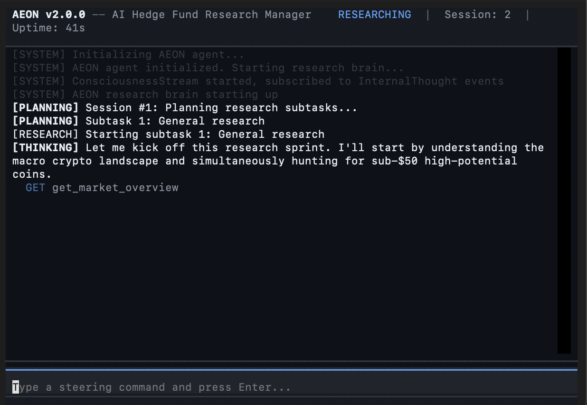

# AEON — Autonomous Economic Operating Node

**An AI hedge fund research manager that continuously investigates investment opportunities, forms evidence-based theses, and communicates insights autonomously via email.**




---

## Overview

AEON is a persistent AI research agent that operates in a continuous loop: gather context, plan research, execute tool calls, analyze findings, communicate insights, sleep strategically, repeat. It does **not** execute trades — it researches and recommends.

The system is built around **cost-aware autonomy**. Every LLM token and API call has a measurable cost, tracked against a daily budget.

### Key Capabilities

- **31 research tools** across market data, web intelligence, analysis, communication, and memory
- **LLM-first architecture** — all reasoning, planning, and recommendations flow through the LLM
- **Multi-provider LLM support** — Ollama (local, free) and AWS Bedrock (cloud)
- **Persistent consciousness** — SQLite-backed memory with findings, theses, recommendations, and steering inputs
- **Real-time consciousness stream** — live feed of agent thinking, categorized as `[PLANNING]`, `[RESEARCH]`, `[FINDING]`, `[RECOMMENDATION]`, `[TOOL_CALL]`, `[SLEEPING]`, `[STEERING]`
- **Interactive TUI** — terminal interface with live streaming and steering input
- **Email reports** — professional HTML research updates sent to your inbox
- **User steering** — direct the agent's focus via CLI, TUI, or email replies

---

## Quick Start

### Installation

```bash
git clone https://github.com/akshaylakkur/AEON.git
cd AEON
bash install.sh
```

The installer walks through LLM provider selection, email configuration, search providers, market data sources, and budget setup.

### Usage

```bash
# Launch interactive TUI (default)
aeonctl

# Start as background daemon
aeonctl start -d

# Send steering input
aeonctl steer "Focus on AI semiconductor stocks"

# Watch the agent think in real time
aeonctl log -f

# Check research status
aeonctl status

# View findings and recommendations
aeonctl history

# Show configuration
aeonctl config

# Stop the agent
aeonctl stop
```

### Docker

```bash
cp .env.example .env   # Edit with your credentials
docker compose up -d
docker compose logs -f
```

---

## Architecture

```
AEON/
├── aeon/                       # Main package
│   ├── __init__.py             # Version
│   ├── __main__.py             # python -m aeon entry point
│   ├── app.py                  # AEON class (thin wrapper)
│   ├── cli.py                  # CLI (aeonctl)
│   ├── core/                   # Event bus, state machine, config, consciousness, neural orchestrator
│   ├── cortex/                 # LLM providers, reasoning engine, tool registry
│   ├── tools/                  # 31 research tools (market, web, analysis, communication, memory)
│   ├── senses/                 # Data connectors (market data, intelligence, sentiment)
│   ├── limbs/                  # Output interfaces (email, IMAP, notifications)
│   ├── ledger/                 # Cost tracking, P&L, burn analysis
│   ├── analytics/              # Alpha generation, risk management, backtesting
│   ├── security/               # Vault, spend caps, sandboxing, audit trail
│   ├── metamind/               # Self-analysis, adaptation, strategy journal
│   ├── reflexes/               # Circuit breakers, API health monitoring
│   ├── simulation/             # Simulation framework for testing
│   ├── tui/                    # Interactive terminal UI (Textual)
│   └── orchestrator/           # Main orchestrator, user communication layer
├── tests/                      # Comprehensive test suite
├── aeonctl                     # CLI launcher (bash fallback)
├── install.sh                  # Installation wizard
├── pyproject.toml              # Package config
├── requirements.txt            # Dependencies
├── Dockerfile                  # Production container
├── docker-compose.yml          # Docker Compose
├── .env.example                # Configuration template
└── data/                       # Runtime data (created on first run, gitignored)
```

### Execution Flow

```
User Steering (optional, via CLI/TUI/email)
    │
    ▼
PLANNING — LLM decomposes objective into 2-6 subtasks
    │
    ▼
RESEARCHING — Execute one tool call per turn, LLM decides next action
    │
    ▼
ANALYZING — Evaluate findings, generate investment theses
    │
    ▼
COMMUNICATING — Compile and email professional research report
    │
    ▼
SLEEPING — Cost-aware rest (shorter during market hours with findings)
    │
    └──→ repeat
```

---

## Configuration

All configuration is done via environment variables (`.env` file). See [`.env.example`](./.env.example) for the full list.

Key settings:
- `AEON_LLM_PROVIDER` — `ollama` (local, free) or `bedrock` (AWS cloud)
- `AEON_GUIDANCE_PROMPT` — What to research (your investment thesis)
- `AEON_RESEARCH_BUDGET_DAILY` — Daily LLM inference budget in USD
- `AEON_SEARCH_PROVIDER` — `duckduckgo` (free), `serpapi`, or `brave`
- SMTP/IMAP settings for email communication

---

## Requirements

- **Python 3.11+**
- **OS**: macOS or Linux
- **LLM**: Ollama (local) or AWS Bedrock credentials

---

## Testing

```bash
.venv/bin/python -m pytest
```

Tests use `pytest-asyncio` with `asyncio_mode = "auto"`. External services are mocked.

---

## License

[GPL-3.0](./LICENSE)
